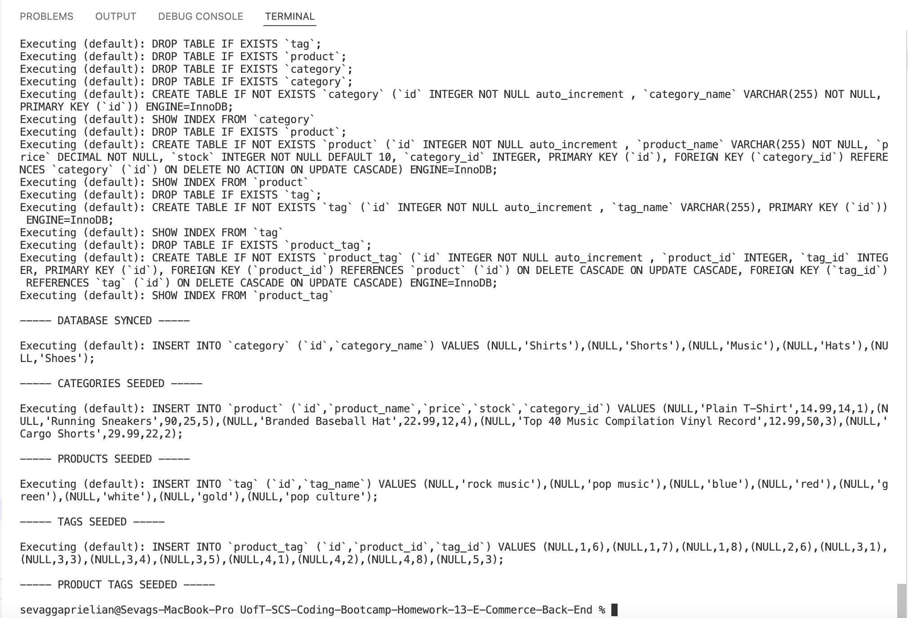
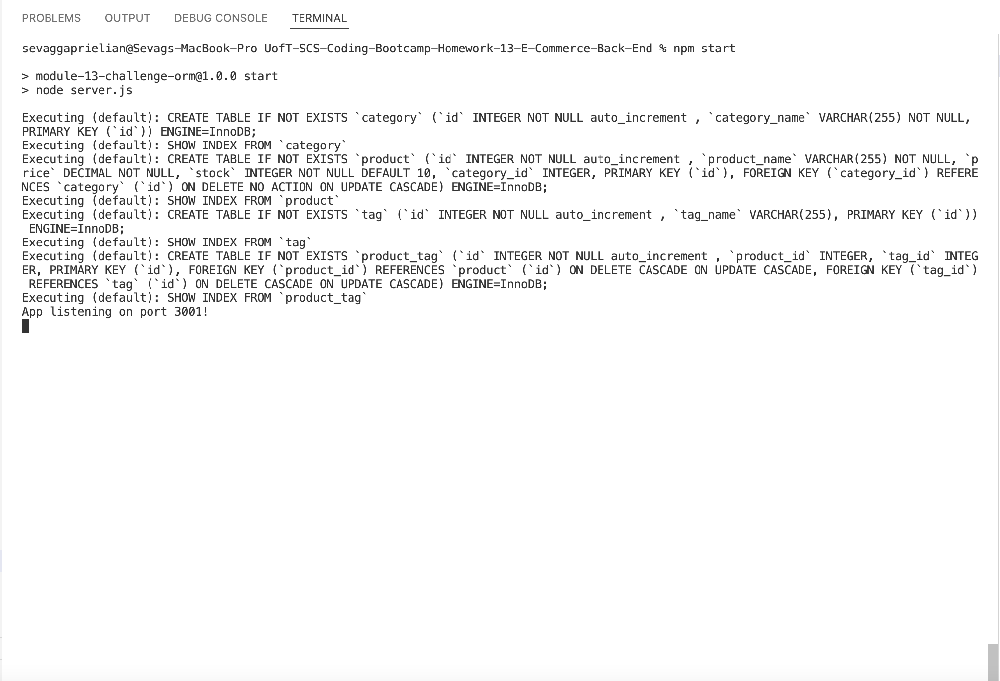
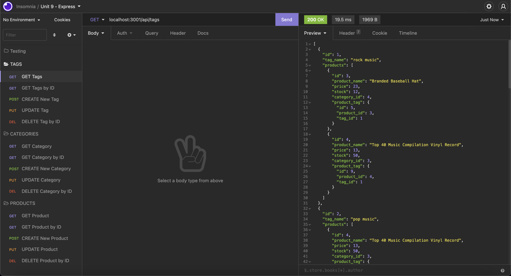

# UofT-SCS-Coding-Bootcamp-Homework-13-E-Commerce-Back-End

## Table of Contents
* [Description](#desc)  
* [Installation](#install)  
* [Usage](#usage)  
* [Credits](#credits)  
* [License](#license)  
* [Github](#github)  

## Description

Internet retail, also known as e-commerce, is the largest sector of the electronics industry, generating an estimated $29 trillion in 2019. E-commerce platforms like Shopify and WooCommerce provide a suite of services to businesses of all sizes. Due to their prevalence, understanding the fundamental architecture of these platforms will benefit you as a full-stack web developer.

The purpose of this project was to build the back end for an e-commerce site by modifying starter code. We were responsible for successfully configuring a working Express.js API to use Sequelize to interact with a MySQL database.

## Installation
Clone the repository, and create a .env file. In the file include the following:  

* DB_NAME=ecommerce_db
* DB_USER=root
* DB_PW= 'your MySQL password to connect to the MySQL server'  

Run npm install to install the necessary mysql2, express, dotenv, and sequelize packages. Login to your MySQL shell in the command line, and run the schema. Exit the MySQL shell and seed the databse by running the node seeds/index.js command. Once complete run the npm start command to start the application.
 
 
## Usage
The following image shows the application's appearance and functionality.

The application should appear as follows after successfully seeding the database:

The application should appear as follows after successfully starting the Express server:

The application should appear as follows after executing GET routes:

The application should appear as follows after executing POST routes:

The application should appear as follows after executing DELETE routes:

 
## Credits
Uoft SCS Coding Bootcamp Gitlab

 
## License
Copyright [2021] [Sevag Gaprielian]

Licensed under the Apache License, Version 2.0 (the "License"); you may not use this file except in compliance with the License.
You may obtain a copy of the License at http://www.apache.org/licenses/LICENSE-2.0.

Unless required by applicable law or agreed to in writing, software
distributed under the License is distributed on an "AS IS" BASIS,
WITHOUT WARRANTIES OR CONDITIONS OF ANY KIND, either express or implied.
See the License for the specific language governing permissions and
limitations under the License.

 
## GitHub
Github: sevaggap  
Walkthrough Video: https://drive.google.com/file/d/1oWvCGciMdLX2hNkdpJCpSfWbTXLw59KU/view?usp=sharing